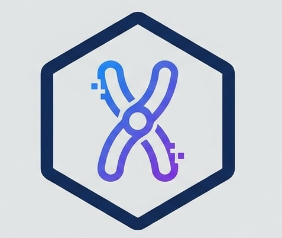

<p align="center">
  
</p>

<h1 align="center">ChromDetect</h1>

<p align="center">
  <a href="https://pypi.org/project/chromdetect/"></a>
  <a href="https://pypi.org/project/chromdetect/"></a>
  <a href="https://opensource.org/licenses/MIT"></a>
  <a href="https://github.com/shandley/chromdetect/actions/workflows/test.yml"></a>
</p>

<p align="center">
  <strong>A utility to classify scaffolds in genome assemblies based on naming conventions and size.</strong>
</p>

---

## What It Does

ChromDetect is a simple utility that classifies scaffolds in genome assemblies as chromosomes, unlocalized, or unplaced sequences. It works by:

1. **Matching scaffold names** against common naming patterns (`chr1`, `Super_scaffold_1`, `LG_1`, `NC_*`, etc.)
2. **Using size heuristics** (large scaffolds are likely chromosomes)
3. **Adjusting for expected karyotype** if you know the chromosome count

## Why Use It?

Genome assemblies use inconsistent naming conventions:

```
Super_scaffold_1, chr1, LG_1, HiC_scaffold_1, NC_000001.11, scaffold_1_cov50...
```

If you need to quickly identify which scaffolds are chromosomes—for filtering, statistics, or downstream analysis—ChromDetect automates that classification.

**This is a utility tool, not a validator.** It doesn't detect misassemblies or verify correctness. For assembly QC, use tools like QUAST or Merqury.

## Installation

```bash
pip install chromdetect
```

Or install from source:

```bash
git clone https://github.com/shandley/chromdetect.git
cd chromdetect
pip install -e .
```

## Example Data

ChromDetect includes synthetic test assemblies in the `examples/` directory:

```bash
# Try it immediately after installation
chromdetect examples/synthetic_assembly.fasta

# Compare two assembly versions
chromdetect examples/synthetic_assembly.fasta --compare examples/synthetic_assembly_v2.fasta
```

### Downloading Real Genome Assemblies

For testing with real data, we recommend these small, well-annotated assemblies:

**Saccharomyces cerevisiae S288C** (Yeast, ~12 Mb, 16 chromosomes):
```bash
# Using NCBI datasets CLI (install: pip install ncbi-datasets-cli)
datasets download genome accession GCF_000146045.2 --include genome
unzip ncbi_dataset.zip
chromdetect ncbi_dataset/data/GCF_000146045.2/GCF_000146045.2_R64_genomic.fna
```

**Caenorhabditis elegans** (Nematode, ~100 Mb, 6 chromosomes):
```bash
datasets download genome accession GCF_000002985.6 --include genome
unzip ncbi_dataset.zip
chromdetect ncbi_dataset/data/GCF_000002985.6/*.fna
```

**Arabidopsis thaliana** (Plant, ~135 Mb, 5 chromosomes):
```bash
datasets download genome accession GCF_000001735.4 --include genome
unzip ncbi_dataset.zip
chromdetect ncbi_dataset/data/GCF_000001735.4/*.fna --karyotype 5
```

For more test data options, see [NCBI Datasets](https://www.ncbi.nlm.nih.gov/datasets/) or [GenomeArk](https://genomeark.org) (VGP assemblies).

## Quick Start

### Command Line

```bash
# Basic usage - get summary
chromdetect assembly.fasta

# Output JSON for programmatic use
chromdetect assembly.fasta --format json --output results.json

# Use karyotype information for better accuracy
chromdetect assembly.fasta --karyotype 24

# Export only chromosome-level scaffolds as TSV
chromdetect assembly.fasta --chromosomes-only --format tsv > chromosomes.tsv

# Export as BED or GFF format for pipeline integration
chromdetect assembly.fasta --format bed > scaffolds.bed
chromdetect assembly.fasta --format gff > scaffolds.gff

# Extract chromosome sequences to a new FASTA file
chromdetect assembly.fasta --extract-chromosomes chromosomes.fasta

# Batch process multiple assemblies
chromdetect --batch assemblies_dir/ --output results_dir/

# Compare two assemblies side-by-side
chromdetect assembly_v1.fasta --compare assembly_v2.fasta

# Generate visual HTML report
chromdetect assembly.fasta --format html -o report.html

# Use custom naming patterns
chromdetect assembly.fasta --patterns custom_patterns.yaml

# Use NCBI assembly report for accurate classification
chromdetect assembly.fasta --assembly-report GCF_000001405.assembly_report.txt
```

### Python API

```python
# Simple one-liner classification (recommended for most use cases)
from chromdetect import classify_fasta, compare_fasta_files

results, stats = classify_fasta("assembly.fasta")
print(f"Found {stats.chromosome_count} chromosomes")
print(f"N50: {stats.n50 / 1e6:.1f} Mb")

# Compare two assemblies
comparison = compare_fasta_files("assembly_v1.fasta", "assembly_v2.fasta")
print(f"Shared chromosomes: {len(comparison.shared_chromosomes)}")
print(f"N50 change: {comparison.summary()['n50_difference']:,} bp")
```

For more control, use the lower-level API:

```python
from chromdetect import (
    parse_fasta, classify_scaffolds, write_fasta, format_bed, format_gff,
    parse_assembly_report
)

# Parse and classify with options
scaffolds = parse_fasta("assembly.fasta.gz")
results, stats = classify_scaffolds(scaffolds, expected_chromosomes=24)

# Print summary
print(f"Found {stats.chromosome_count} chromosomes")
print(f"Total assembly: {stats.total_length / 1e9:.2f} Gb")

# Access individual scaffold classifications
for r in results:
    if r.classification == "chromosome":
        print(f"{r.name}: {r.length:,} bp (confidence: {r.confidence:.2f})")

# Export to BED or GFF format
bed_output = format_bed(results)
gff_output = format_gff(results)

# Use NCBI assembly report for authoritative classification
report = parse_assembly_report("assembly_report.txt")
results, stats = classify_scaffolds(scaffolds, assembly_report=report)
```

## Output Formats

### Summary (default)

```
============================================================
CHROMDETECT ASSEMBLY ANALYSIS
============================================================

Total scaffolds:     1,234
Total length:        2,876,543,210 bp (2.88 Gb)
N50:                 45,678,901 bp (45.7 Mb)
N90:                 12,345,678 bp
Largest scaffold:    198,765,432 bp

Scaffold Classification:
  Chromosomes:       24 (2.85 Gb)
  Unlocalized:       15
  Unplaced:          1,195

Chromosome N50:      118,234,567 bp (118.2 Mb)
GC content:          41.2%
```

### JSON

```json
{
  "summary": {
    "total_scaffolds": 1234,
    "chromosome_count": 24,
    "n50": 45678901,
    ...
  },
  "scaffolds": [
    {
      "name": "chr1",
      "length": 198765432,
      "classification": "chromosome",
      "confidence": 0.95,
      "detection_method": "name_chr_explicit",
      "chromosome_id": "1"
    },
    ...
  ]
}
```

### TSV

```
name    length    classification    confidence    method    chromosome_id
chr1    198765432    chromosome    0.95    name_chr_explicit    1
chr2    175432198    chromosome    0.93    name_chr_explicit    2
...
```

### BED

Standard BED6 format for integration with bedtools, IGV, and other genomics tools:

```
chr1    0    198765432    chromosome    950    .
chr2    0    175432198    chromosome    930    .
...
```

### GFF3

GFF3 format with classification metadata in attributes:

```
##gff-version 3
chr1    chromdetect    chromosome    1    198765432    0.950    .    .    ID=chr1;Name=chr1;classification=chromosome;detection_method=name_chr_explicit;chromosome_id=1
...
```

## Options

| Option | Description |
|--------|-------------|
| `-f, --format` | Output format: `summary`, `json`, `tsv`, `bed`, `gff`, `html` (default: summary) |
| `-o, --output` | Write output to file instead of stdout |
| `-k, --karyotype` | Expected chromosome count for karyotype-informed detection |
| `-s, --min-size` | Minimum size (bp) to consider chromosome-level (default: 10Mb) |
| `-c, --chromosomes-only` | Only output chromosome-level scaffolds |
| `--extract-chromosomes` | Extract chromosome sequences to a FASTA file |
| `--batch` | Process all FASTA files in a directory |
| `--compare` | Compare with a second assembly (side-by-side analysis) |
| `--patterns` | Custom patterns file (YAML or JSON) for scaffold name matching |
| `--assembly-report` | NCBI assembly report file for authoritative classification |
| `--min-confidence` | Minimum confidence threshold (0.0-1.0) to include scaffolds |
| `--min-length` | Minimum scaffold length (bp) to include in output |
| `-q, --quiet` | Suppress progress messages |
| `-v, --verbose` | Show detailed processing information |

## Supported Naming Conventions

ChromDetect recognizes these naming patterns (case-insensitive):

| Pattern | Examples | Method |
|---------|----------|--------|
| Explicit chromosome | `chr1`, `chromosome_X`, `Chr_MT` | `name_chr_explicit` |
| Super scaffold | `Super_scaffold_1`, `Superscaffold_X` | `name_super_scaffold` |
| SUPER | `SUPER_1`, `SUPER1` | `name_SUPER` |
| Linkage group | `LG1`, `LG_X` | `name_linkage_group` |
| NCBI RefSeq | `NC_000001.11` | `name_ncbi_refseq` |
| NCBI GenBank | `CM000001.1` | `name_ncbi_genbank` |
| HiC scaffold | `HiC_scaffold_1` | `name_hic_scaffold` |
| RaGOO | `Scaffold_1_RaGOO` | `name_ragoo` |
| Simple numeric | `1`, `X`, `MT` | `name_numeric` |

Patterns that indicate **unlocalized** scaffolds:
- `*_random`, `*_unloc*`, `chrUn_*`

Patterns that indicate **unplaced** scaffolds (contigs/fragments):
- `*_ctg*`, `*contig*`, `*_arrow_*`, `*_pilon*`, `*_hap*`

## How It Works

ChromDetect combines name-based and size-based detection with these priority rules:

1. **Strong name match (confidence ≥ 0.8)** takes priority
2. **Large scaffold + weak name match** = chromosome with boosted confidence
3. **Large scaffold + no name match** = chromosome with reduced confidence
4. **Small scaffold** = unplaced regardless of name

When `--karyotype` is provided:
- If too many candidates: demote lowest-confidence chromosomes
- If too few candidates: promote largest unplaced scaffolds

## Use Cases

### VGP Assembly Classification

```bash
# Classify scaffolds in a VGP curated assembly
chromdetect species.pri.cur.fasta.gz --karyotype 24 --format json
```

### Multi-Assembly Classification

```python
from chromdetect import classify_fasta

# Classify multiple assemblies independently
species = [
    ("human.fa", 23),
    ("mouse.fa", 20),
    ("zebrafish.fa", 25),
]

for fasta, expected_chr in species:
    results, stats = classify_fasta(fasta)
    print(f"{fasta}: {stats.chromosome_count} chromosomes detected (expected {expected_chr})")
```

Note: This classifies each assembly independently. ChromDetect does not perform synteny analysis or identify homologous chromosomes across species.

### Pipeline Integration

```bash
# As part of assembly QC pipeline
chromdetect assembly.fasta --format json | jq '.summary.chromosome_count'

# Export scaffold regions in BED format for downstream analysis
chromdetect assembly.fasta --format bed --chromosomes-only > chromosomes.bed
bedtools getfasta -fi assembly.fasta -bed chromosomes.bed -fo chr_regions.fa
```

### Batch Processing

```bash
# Process all assemblies in a directory
chromdetect --batch assemblies/ --format json --output results/

# This creates:
# - results/assembly1.json
# - results/assembly2.json
# - ...
# - results/batch_summary.tsv  (overview of all assemblies)
```

### Extract Chromosome Sequences

```bash
# Extract only chromosome-level sequences to a new FASTA
chromdetect assembly.fasta --extract-chromosomes chromosomes.fasta

# Combine with other options
chromdetect assembly.fasta \
    --karyotype 24 \
    --extract-chromosomes chromosomes.fasta \
    --format json --output report.json
```

### Using NCBI Assembly Reports

```bash
# Download an assembly report from NCBI
# https://www.ncbi.nlm.nih.gov/assembly/GCF_000001405.40

# Use it for authoritative scaffold classification
chromdetect GRCh38.fasta --assembly-report GCF_000001405.40_GRCh38.p14_assembly_report.txt
```

## Limitations

ChromDetect uses heuristics and pattern matching—it has inherent limitations:

- **Not a validator:** ChromDetect classifies scaffolds but cannot detect misassemblies, inversions, or sequence errors. Use QUAST, Merqury, or similar tools for assembly validation.

- **Pattern-dependent:** Classification relies on naming conventions. Unusual or custom naming schemes may not be recognized without custom patterns.

- **Size heuristics are approximate:** A 50 Mb scaffold is assumed to be chromosome-level, but could be a misassembly or concatenated contigs.

- **No reference comparison:** ChromDetect doesn't compare against reference genomes, so it cannot identify missing chromosomes or structural variants.

For critical applications, combine ChromDetect with comprehensive QC tools and manual curation.

## Contributing

Contributions are welcome! Please see [CONTRIBUTING.md](CONTRIBUTING.md) for guidelines.

### Adding New Patterns

To add support for a new naming convention:

1. Add the regex pattern to `chromdetect/patterns.py`
2. Include a descriptive method name
3. Ensure the pattern captures chromosome ID in group 1
4. Add tests in `tests/test_patterns.py`

Example:

```python
# In patterns.py
CHROMOSOME_PATTERNS.append(
    (r'^MyConvention_(\d+)$', 'my_convention'),
)
```

### Using Custom Patterns

You can also use custom patterns without modifying the source code:

```yaml
# custom_patterns.yaml
chromosome_patterns:
  - pattern: "^MyScaffold_(\\d+)$"
    name: "my_scaffold"
  - pattern: "^CustomChr_(\\d+)$"
    name: "custom_chr"
unlocalized_patterns:
  - my_random
fragment_patterns:
  - my_contig
```

```bash
chromdetect assembly.fasta --patterns custom_patterns.yaml
```

## Citation

If you use ChromDetect in your research, please cite it using the metadata from our [CITATION.cff](CITATION.cff) file:

```bibtex
@software{chromdetect,
  author = {Handley, Scott A.},
  title = {ChromDetect: A utility for classifying scaffolds in genome assemblies},
  url = {https://github.com/shandley/chromdetect},
  version = {0.5.0},
  year = {2024}
}
```

[](https://doi.org/10.5281/zenodo.XXXXXXX)

> **Note**: Replace the Zenodo DOI badge above with the actual DOI after your first GitHub release triggers Zenodo archival.

## License

MIT License - see [LICENSE](LICENSE) for details.

## Related Projects

- [QUAST](https://github.com/ablab/quast) - Quality assessment tool for genome assemblies
- [Verity](https://github.com/shandley/verity) - Hi-C-based assembly validation framework
