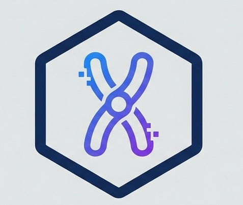

<p align="center">
  
</p>

<h1 align="center">ChromDetect</h1>

<p align="center">
  <a href="https://pypi.org/project/chromdetect/"></a>
  <a href="https://pypi.org/project/chromdetect/"></a>
  <a href="https://opensource.org/licenses/MIT"></a>
  <a href="https://github.com/shandley/chromdetect/actions/workflows/test.yml"></a>
</p>

<p align="center">
  <strong>A comprehensive toolkit for genome assembly classification, validation, and quality control.</strong>
</p>

---

## What It Does

ChromDetect is a Python toolkit for working with genome assemblies. It provides:

1. **Scaffold Classification** - Classify scaffolds as chromosomes, unlocalized, or unplaced based on naming conventions and size heuristics
2. **Assembly Validation** - Validate FASTA files against NCBI assembly reports
3. **Karyotype Checking** - Verify chromosome counts against expected karyotypes for 29+ species
4. **Name Standardization** - Convert between naming conventions (UCSC, Ensembl, RefSeq, GenBank)
5. **Version Tracking** - Compare assembly versions and track scaffold changes over time
6. **Multi-Assembly QC Dashboard** - Generate comparative quality reports across multiple assemblies

## Why Use It?

Genome assemblies use inconsistent naming conventions:

```
Super_scaffold_1, chr1, LG_1, HiC_scaffold_1, NC_000001.11, scaffold_1_cov50...
```

ChromDetect provides a unified toolkit for classifying, validating, and standardizing these assemblies.

**This is a utility tool, not a validator.** It doesn't detect misassemblies or verify sequence correctness. For assembly QC, use tools like QUAST or Merqury.

## Installation

```bash
pip install chromdetect
```

Or install from source:

```bash
git clone https://github.com/shandley/chromdetect.git
cd chromdetect
pip install -e .
```

## Quick Start

### Basic Classification

```bash
# Get summary of an assembly
chromdetect assembly.fasta

# Output JSON for programmatic use
chromdetect assembly.fasta --format json --output results.json

# Use karyotype information for better accuracy
chromdetect assembly.fasta --karyotype 24

# Generate visual HTML report
chromdetect assembly.fasta --format html -o report.html
```

### Validation Features

```bash
# Validate FASTA against NCBI assembly report
chromdetect assembly.fasta --assembly-report report.txt --validate

# Check chromosome count against expected karyotype
chromdetect assembly.fasta --check-karyotype human

# List available species in karyotype database
chromdetect --list-species
```

### Standardization Features

```bash
# Rename scaffolds to UCSC convention (chr1, chr2, chrX)
chromdetect assembly.fasta --rename ucsc -o renamed.fasta

# Rename to Ensembl convention (1, 2, X)
chromdetect assembly.fasta --rename ensembl -o renamed.fasta

# Check NCBI submission compliance
chromdetect assembly.fasta --check-compliance

# Detect current naming convention
chromdetect assembly.fasta --detect-convention
```

### Version Comparison

```bash
# Compare two assembly versions
chromdetect v1.fasta --compare-versions v2.fasta

# Track changes in JSON format
chromdetect v1.fasta --compare-versions v2.fasta --format json
```

### Multi-Assembly Dashboard

```bash
# Generate QC dashboard for multiple assemblies
chromdetect --dashboard *.fasta -o dashboard.html --format html

# Compare assemblies in TSV format
chromdetect --dashboard assembly1.fa assembly2.fa assembly3.fa --format tsv
```

## Features

### 1. Scaffold Classification

Classify scaffolds using pattern matching and size heuristics:

```bash
chromdetect assembly.fasta --format summary
```

Output:
```
============================================================
CHROMDETECT ASSEMBLY ANALYSIS
============================================================

Total scaffolds:     1,234
Total length:        2,876,543,210 bp (2.88 Gb)
N50:                 45,678,901 bp (45.7 Mb)

Scaffold Classification:
  Chromosomes:       24 (2.85 Gb)
  Unlocalized:       15
  Unplaced:          1,195
```

### 2. Assembly Report Validation

Validate FASTA files against NCBI assembly reports to detect:
- Missing sequences
- Size mismatches
- Accession mapping issues

```bash
chromdetect assembly.fasta --assembly-report report.txt --validate

# With size tolerance (allow 1% difference)
chromdetect assembly.fasta --assembly-report report.txt --validate --size-tolerance 0.01

# Strict mode (treat warnings as errors)
chromdetect assembly.fasta --assembly-report report.txt --validate --strict
```

### 3. Karyotype Consistency Checking

Verify assemblies against expected karyotypes for 29 species:

```bash
# Check human assembly
chromdetect assembly.fasta --check-karyotype human

# Check mouse assembly
chromdetect assembly.fasta --check-karyotype "Mus musculus"

# Check by taxonomy ID
chromdetect assembly.fasta --check-karyotype 9606

# List all available species
chromdetect --list-species
```

Supported species include: human, mouse, rat, zebrafish, fruit fly, C. elegans, Arabidopsis, chicken, dog, cat, horse, cow, pig, sheep, goat, rabbit, guinea pig, frog, rice, maize, wheat, soybean, tomato, yeast, E. coli, and more.

### 4. Assembly Standardization

Convert between naming conventions:

| Convention | Example Names |
|------------|---------------|
| UCSC | chr1, chr2, chrX, chrM |
| Ensembl | 1, 2, X, MT |
| RefSeq | NC_000001.11, NC_000023.11 |
| GenBank | CM000663.2, CM000685.2 |

```bash
# Convert to UCSC style
chromdetect assembly.fasta --rename ucsc -o ucsc_assembly.fasta

# Convert to Ensembl style
chromdetect assembly.fasta --rename ensembl -o ensembl_assembly.fasta

# Check NCBI submission compliance
chromdetect assembly.fasta --check-compliance
```

### 5. Assembly Version Tracking

Compare two versions of an assembly to detect:
- Scaffold promotions (unplaced → chromosome)
- Scaffold demotions (chromosome → unplaced)
- Significant size changes (potential merges/splits)
- Added/removed scaffolds
- N50 and chromosome count changes

```bash
chromdetect v1.fasta --compare-versions v2.fasta
```

Output:
```
======================================================================
ASSEMBLY VERSION COMPARISON
======================================================================
Version 1: v1.fasta
Version 2: v2.fasta

METRIC CHANGES:
----------------------------------------
Total scaffolds:       1,234 →      1,198 (-36)
Chromosomes:              22 →         24 (+2)
N50:            45,678,901 →  52,345,678 (+6,666,777 bp, +14.6%)

SCAFFOLD CHANGES:
----------------------------------------
Unchanged:     1,150
Promoted:          2
Demoted:           0
Added:            48
Removed:          84
```

### 6. Multi-Assembly QC Dashboard

Generate comparative quality reports across multiple assemblies:

```bash
# Generate interactive HTML dashboard
chromdetect --dashboard *.fasta -o dashboard.html --format html
```

The HTML dashboard includes:
- Summary statistics cards
- Interactive charts (N50, chromosome counts, coverage)
- Sortable comparison table
- QC warnings and flags

```bash
# JSON output for programmatic use
chromdetect --dashboard *.fasta --format json -o qc_report.json

# TSV for spreadsheet analysis
chromdetect --dashboard *.fasta --format tsv -o comparison.tsv
```

## Python API

```python
from chromdetect import classify_fasta

# Basic classification
results, stats = classify_fasta("assembly.fasta")
print(f"Found {stats.chromosome_count} chromosomes")
print(f"N50: {stats.n50 / 1e6:.1f} Mb")
```

### Validation API

```python
from chromdetect.validation import validate_fasta_against_report

result = validate_fasta_against_report(
    "assembly.fasta",
    "assembly_report.txt",
    size_tolerance=0.01
)
print(f"Valid: {result.is_valid}")
print(f"Errors: {len(result.errors)}")
```

### Karyotype API

```python
from chromdetect.karyotype import validate_karyotype, KaryotypeDatabase

db = KaryotypeDatabase()
result = validate_karyotype(
    ["1", "2", "3", "X", "Y"],
    species="human",
    database=db
)
print(f"Valid: {result.is_valid}")
```

### Standardization API

```python
from chromdetect.standardize import standardize_fasta, check_ncbi_compliance

# Rename scaffolds
result = standardize_fasta(
    "input.fasta",
    "output.fasta",
    target_convention="ucsc",
    species="human"
)
print(f"Renamed {result.renamed_count} scaffolds")

# Check compliance
from chromdetect.core import parse_fasta
scaffolds = parse_fasta("assembly.fasta")
compliance = check_ncbi_compliance(scaffolds)
print(f"Compliant: {compliance.is_compliant}")
```

### Version Comparison API

```python
from chromdetect.version import compare_fasta_files

result = compare_fasta_files("v1.fasta", "v2.fasta")
print(f"N50 change: {result.n50_change:+,} bp")
print(f"Promoted scaffolds: {result.promoted_count}")
print(f"Demoted scaffolds: {result.demoted_count}")
```

### Dashboard API

```python
from chromdetect.dashboard import analyze_multiple_assemblies, generate_dashboard_html

result = analyze_multiple_assemblies(["a1.fasta", "a2.fasta", "a3.fasta"])
html = generate_dashboard_html(result)

with open("dashboard.html", "w") as f:
    f.write(html)
```

## Output Formats

| Format | Description | Use Case |
|--------|-------------|----------|
| `summary` | Human-readable text (default) | Quick inspection |
| `json` | Structured JSON | Programmatic access |
| `tsv` | Tab-separated values | Spreadsheet analysis |
| `bed` | BED6 format | Genomics pipelines |
| `gff` | GFF3 format | Genome browsers |
| `html` | Interactive HTML report | Visual inspection |

## Command Line Options

| Option | Description |
|--------|-------------|
| `-f, --format` | Output format: `summary`, `json`, `tsv`, `bed`, `gff`, `html` |
| `-o, --output` | Write output to file |
| `-k, --karyotype` | Expected chromosome count |
| `-s, --min-size` | Minimum chromosome size (default: 10Mb) |
| `-c, --chromosomes-only` | Only output chromosomes |
| `--extract-chromosomes` | Extract chromosome sequences to FASTA |
| `--batch` | Process all FASTA files in directory |
| `--compare` | Compare with second assembly |
| `--validate` | Validate against assembly report |
| `--check-karyotype` | Check against species karyotype |
| `--rename` | Rename to target convention |
| `--check-compliance` | Check NCBI submission compliance |
| `--compare-versions` | Compare two assembly versions |
| `--dashboard` | Generate multi-assembly QC dashboard |
| `--list-species` | List available species |
| `-q, --quiet` | Suppress progress messages |
| `-v, --verbose` | Show detailed information |

## Supported Naming Conventions

ChromDetect recognizes these naming patterns:

| Pattern | Examples | Method |
|---------|----------|--------|
| Explicit chromosome | `chr1`, `chromosome_X`, `Chr_MT` | `name_chr_explicit` |
| Super scaffold | `Super_scaffold_1`, `Superscaffold_X` | `name_super_scaffold` |
| SUPER | `SUPER_1`, `SUPER1` | `name_SUPER` |
| Linkage group | `LG1`, `LG_X` | `name_linkage_group` |
| NCBI RefSeq | `NC_000001.11` | `name_ncbi_refseq` |
| NCBI GenBank | `CM000001.1` | `name_ncbi_genbank` |
| HiC scaffold | `HiC_scaffold_1` | `name_hic_scaffold` |
| RaGOO | `Scaffold_1_RaGOO` | `name_ragoo` |
| Simple numeric | `1`, `X`, `MT` | `name_numeric` |

## Limitations

- **Not a validator:** Cannot detect misassemblies or sequence errors
- **Pattern-dependent:** Unusual naming schemes may not be recognized
- **Size heuristics are approximate:** Large scaffolds assumed to be chromosomes
- **No reference comparison:** Cannot identify missing chromosomes

For critical applications, combine ChromDetect with comprehensive QC tools.

## Contributing

Contributions are welcome! Please see [CONTRIBUTING.md](CONTRIBUTING.md) for guidelines.

### Adding New Patterns

```python
# In patterns.py
CHROMOSOME_PATTERNS.append(
    (r'^MyConvention_(\d+)$', 'my_convention'),
)
```

### Using Custom Patterns

```yaml
# custom_patterns.yaml
chromosome_patterns:
  - pattern: "^MyScaffold_(\\d+)$"
    name: "my_scaffold"
```

```bash
chromdetect assembly.fasta --patterns custom_patterns.yaml
```

## Citation

If you use ChromDetect in your research, please cite:

```bibtex
@software{chromdetect,
  author = {Handley, Scott A.},
  title = {ChromDetect: A toolkit for genome assembly classification and QC},
  url = {https://github.com/shandley/chromdetect},
  version = {0.6.0},
  year = {2025}
}
```

[](https://doi.org/10.5281/zenodo.17945062)

## License

MIT License - see [LICENSE](LICENSE) for details.

## Related Projects

- [QUAST](https://github.com/ablab/quast) - Quality assessment tool for genome assemblies
- [Verity](https://github.com/shandley/verity) - Hi-C-based assembly validation framework
